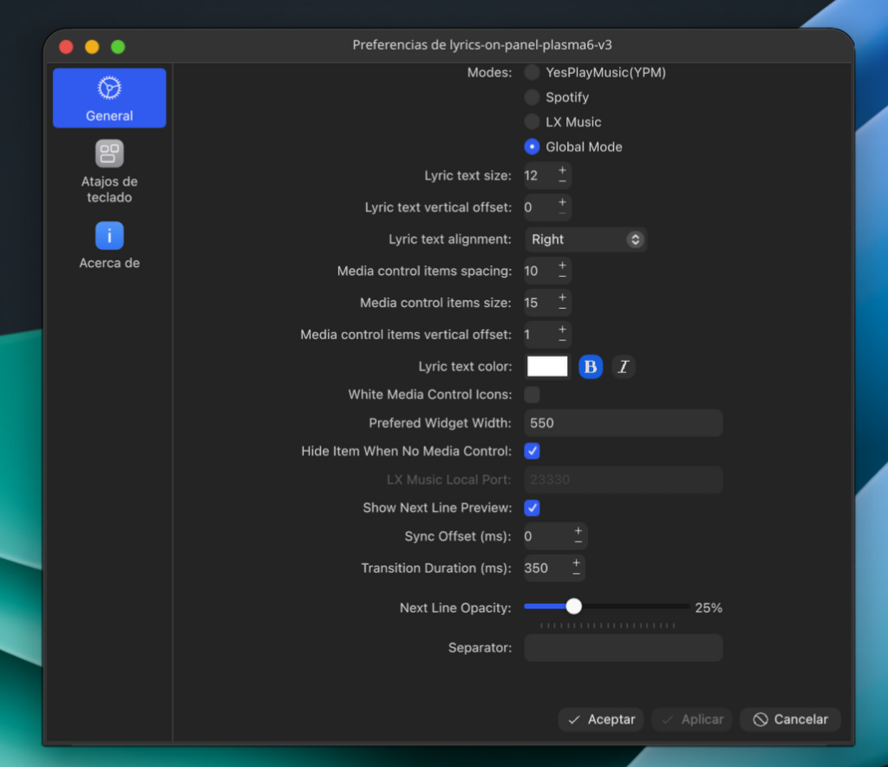
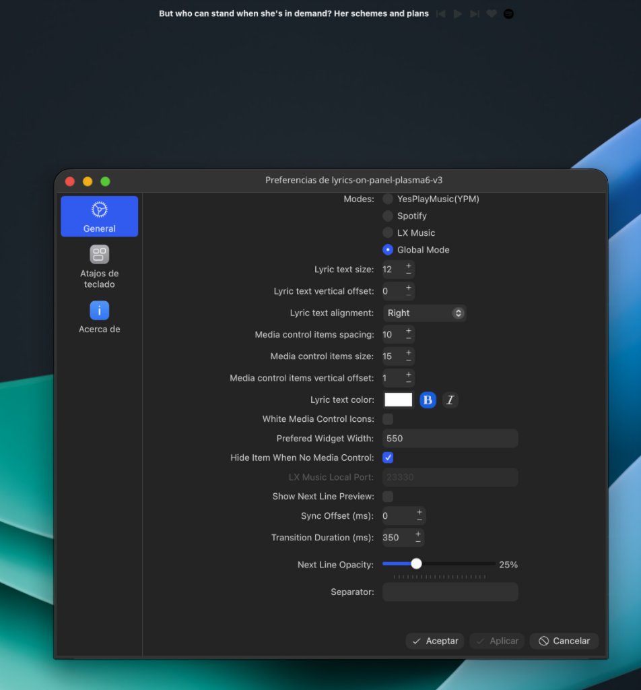

<h1 align="center">Lyrics-on-Panel-v3</h1>

<p align="center">
  
</p>
<p align="center"><b><code>Display lyrics of the currently playing music anywhere on the screen</code></b></p>

----

### 🌟 v3.0.0 (Improved Version) - 2026

This is the enhanced version (v3) of lyrics-on-panel. It introduces advanced animations, performance optimizations, and user-experience improvements over the original version (v2).

> 🔗 Based on the original project by [KangweiZhu](https://github.com/KangweiZhu/lyrics-on-panel). All credit for the original widget goes to them — this fork simply extends and improves it.

#### 🚀 New Features & Improvements

1. **Apple Music Style Transitions (Slide-Up & Cross-Fade)**:
   - Implements smooth Apple Music style vertical transitions. The preview line slides up to replace the active line, scaling from `0.8` to `1.0` with fade transitions, while the old active line fades out and drifts upwards (`-4px`).
   - Unified rendering using hardware scaling (`scale: 0.8`) prevents font anti-aliasing redraws and flickering when changing sizes.
   - Synchronized font weights (bold/italic) eliminate visual jumps during lyric updates.

2. **Adaptive Font Sizing for Small Panels**:
   - Automatically detects the physical panel height. If the height is restricted and next line preview is enabled, it dynamically reduces the font size so that both lines fit perfectly without clipping.
   - Reverts back to the configured default size when the preview is disabled.

3. **Jitter-free Centering & Smooth Shift (`Behavior on y`)**:
   - The active line remains strictly centered vertically so its position is completely stable. Shifting is handled smoothly using a `200ms` `Behavior on y` easing animation.
   - The top coordinate is clamped (`Math.max(2, centerY)`) to ensure the text is never clipped at the top.

4. **Disk Cache Optimization (`/tmp` Cache)**:
   - Implements a SHA-256 local JSON cache under `/tmp/lyrics-on-panel-cache/` in the Python backend. It avoids duplicate network requests, consumes zero persistent storage, and automatically cleans up on system reboot.

5. **Manual Sync Offset**:
   - Adds a configuration slider/input to adjust a manual synchronization offset (from `-5000ms` to `+5000ms`) to correct laggy or fast lyrics.

6. **Full Backwards Compatibility**:
   - The backend server computes and outputs extra metadata while maintaining full backwards compatibility for v2 frontend applets.

----

### Features

This plugin replicates the top-bar lyrics display feature of NetEase Cloud Music/QQ Music on macOS.

👉 Original effect reference: [CSDN Blog Link](https://blog.csdn.net/weixin_34061200/article/details/112693092)

----

### How it works

* Retrieve information of currently playing music and music-player from the MPRIS2 data source. It is compatible with any player that correctly implements the **[MPRIS2 specification](https://specifications.freedesktop.org/mpris-spec/latest/)**.
  * Currently tested with:
    * Spotify
    * LX Music
    * SPlayer
    * Youtube Music
    * Netease Cloud Music (Not wine version)
    * Apple Music

* This plugin uses four approaches to fetch lyrics:
  1. **YesPlayMusic Mode** (https://github.com/qier222/YesPlayMusic): Fetches lyrics of the currently playing music from the local port exposed by YesPlayMusic.
  2. **LX Music Mode** ([lx-music-desktop](https://github.com/lyswhut/lx-music-desktop)): Fetches lyrics of the currently playing music from the local port exposed by LX Music.
  3. **SPlayer Mode** ([SPlayer](https://github.com/imsyy/SPlayer)): Fetches lyrics of the currently playing music from the local port exposed by SPlayer. (Only builds from version 2026.1.4 onwards are available: [3eda65d](https://github.com/imsyy/SPlayer/commit/3eda65dd89fdebade373f20b5890add6ac3ab3df))
  4. **Global Mode**: Fetches lyrics from the [LrcLib](https://lrclib.net/) lyrics database by precisely matching the `artist`, `music(track) title`, and `album name`. If no result is found, it falls back to a fuzzy search using only the **song title**.

----

### Installation Guide

> ⚠️ Tested on **CachyOS (Arch-based)** with **KDE Plasma 6.7.1** only. Other distros may work but are untested. KDE Plasma 5 is **not supported**.

Run these **3 commands** in a terminal — it handles everything automatically:

```bash
git clone https://github.com/bogeta329/lyrics-on-panel-v3.git
cd lyrics-on-panel-v3
./install.sh
```

That's it. The script will install the widget and everything it needs. When it's done, just:

**Right-click your panel → Add Widgets → search `lyrics-on-panel-plasma6-v3` → add it.**

---

#### Distro support

The installer auto-detects your distro and uses the right package manager:

| Distro | Status |
|---|---|
| Arch / CachyOS / Manjaro | ✅ Tested |
| Debian / Ubuntu / Kubuntu | ⚠️ Untested |
| Fedora | ⚠️ Untested |
| openSUSE | ⚠️ Untested |

---

#### Troubleshooting

```bash
# Check if the backend service is running
systemctl --user status Universal-Mpris-LyricServer

# See live logs
journalctl --user -u Universal-Mpris-LyricServer -f
```

----

### Showcase

> ⚠️ **Compatibility Note**: This widget has only been tested on **KDE Plasma 6.7.1**. It is not guaranteed to work on other versions. KDE Plasma 5 is **not supported** by this version.

#### Widget in the Panel


#### Configuration Page — Next Line Preview Enabled

<p align="center">
  
</p>

#### Configuration Page — Next Line Preview Disabled

<p align="center">
  
</p>

## Star History

[](https://www.star-history.com/#bogeta329/lyrics-on-panel-v3&type=date&legend=top-left)

----

## Notes

This project was built using [vibe coding](https://en.wikipedia.org/wiki/Vibe_coding) — an AI-assisted development approach where the overall direction, feature design and iteration were driven by the developer, with AI tools helping implement and refine the code in real time. All features and fixes were reviewed and tested by a human.
