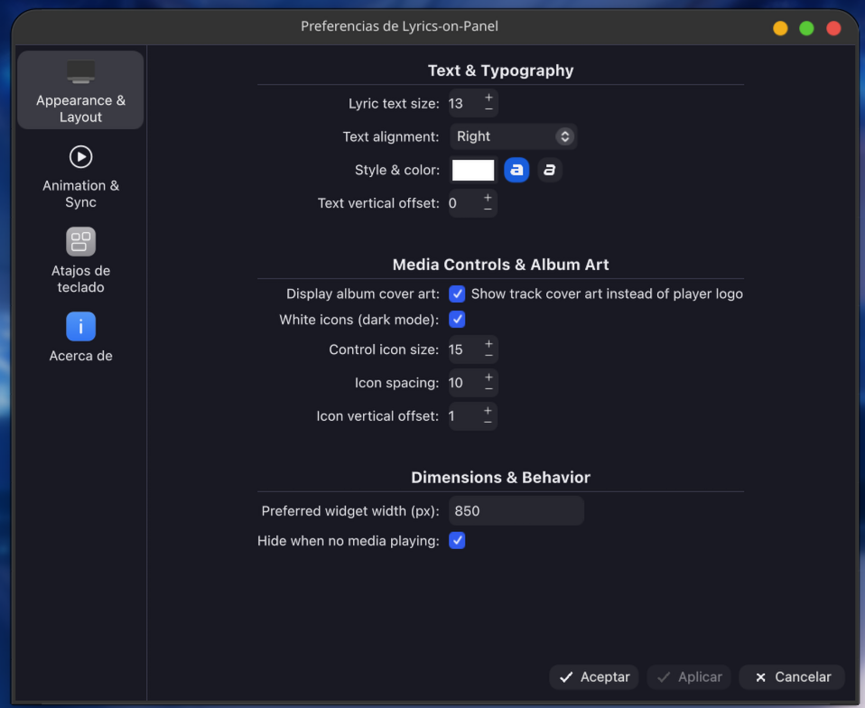

<h1 align="center">Lyrics-on-Panel v3</h1>

<p align="center">
  
</p>

<p align="center">
  <b>Real-time synchronized lyrics display on the KDE Plasma panel for Linux</b>
</p>

<p align="center">
  <a href="https://github.com/bogeta329/lyrics-on-panel-v3/stargazers">
    
  </a>
  <a href="LICENSE">
    
  </a>
  <a href="#distro-support">
    
  </a>
  <a href="https://www.kde.org/plasma-desktop">
    
  </a>
</p>

---

## 📌 About This Fork

This repository is an improved **v3.0 / v3.1 fork** of the original [lyrics-on-panel](https://github.com/KangweiZhu/lyrics-on-panel) widget created by [KangweiZhu](https://github.com/KangweiZhu).

While maintaining full compatibility with original player integrations, this fork focuses on fixing major performance bottlenecks, expanding Linux distribution support with a one-click installer, improving lyric transition animations, and delivering a seamless experience out of the box.

---

## 🚀 Key Improvements & Features

### 🛠️ Universal One-Click Installer (`install.sh`)
- **Cross-distro support**: Auto-detects your Linux distribution (`pacman`, `apt`, `dnf`, `zypper`) and automatically installs all required system dependencies.
- **Auto environment setup**: Automatically provisions an isolated Python virtual environment via `uv`, registers the KDE Plasma applet, and creates a `systemd` user service (`Universal-Mpris-LyricServer`).
- **Plasma 5 & 6 compatible**: Detects `kpackagetool5`/`kpackagetool6` and automatically restarts `plasmashell`.

### ✨ Visual & Animation Enhancements
- **Apple Music-style transitions**: Smooth vertical slide-up and cross-fade transitions. The upcoming lyric preview line slides up seamlessly to become the active line (`scale: 0.8` to `1.0`), while the previous line fades out.
- **Dynamic widget width**: Widget width dynamically expands up to `850px` so long lyric phrases are displayed **100% complete** directly on the panel without clipping.
- **Responsive marquee bounce**: When panel space is constrained by neighboring widgets, long text triggers a smooth marquee bounce with a fast `300ms` initial response and an end pause so the entire phrase is easily readable.
- **Album cover art support**: Option to display actual track album cover art from MPRIS metadata instead of generic player icons.
- **Next line preview**: Configurable preview line rendered at reduced opacity (`0.4` default).

### ⚡ Backend & Lyrics Engine Improvements
- **CPU & performance fix**: Solves high CPU utilization on low-end hardware by optimizing the backend polling loop and eliminating unnecessary QML redraws.
- **Instant track change reset**: Lyrics immediately clear and reload when switching tracks, fixing the stuck lyrics bug from previous versions.
- **Multi-provider fallback (LRCLIB + Kugou)**: Automatically queries [LRCLIB](https://lrclib.net/) and falls back to Kugou Music API when no synced lyrics are found, drastically increasing match rates.
- **Automatic metadata sanitization**: Cleans track titles before querying remote APIs, stripping noisy tags like `(Official Video)`, `(feat. ...)`, `- Remastered 2021`, etc.
- **Disk lyrics cache**: SHA-256 JSON cache stored under `/tmp/lyrics-on-panel-cache/` eliminates redundant API calls and auto-cleans on reboot.
- **Manual sync offset**: In-app slider to fine-tune lyric synchronization from `-5000ms` to `+5000ms`.

---

## 🎧 Supported Media Players & Modes

Works with any media player supporting the **[MPRIS2 Specification](https://specifications.freedesktop.org/mpris-spec/latest/)**, including:

- **Spotify**
- **LX Music** (`lx-music-desktop`)
- **YesPlayMusic**
- **SPlayer**
- **Apple Music / YouTube Music** (via browser or native desktop clients)
- **VLC, Rhythmbox, Amberol, Audacious**, and more.

---

## 📥 Installation

### 1-Click Universal Installer

Run the following commands in your terminal:

```bash
git clone https://github.com/bogeta329/lyrics-on-panel-v3.git
cd lyrics-on-panel-v3
./install.sh
```

Once installation finishes:
1. Right-click your KDE panel → **Add Widgets...**
2. Search for **`lyrics-on-panel-plasma6-v3`** (or `Lyrics-on-Panel`).
3. Drag and drop it onto your panel.

### 📋 Distro Support Matrix

> 💡 In theory, the universal installer should work on **any Linux distribution** with KDE Plasma. However, it has only been directly tested on **Arch Linux (CachyOS)** and **Debian / Ubuntu (Kubuntu)**.

| Distribution | Status | Package Manager |
|---|---|---|
| **Arch Linux / CachyOS / Manjaro** | ✅ Tested (CachyOS) | `pacman` |
| **Debian / Ubuntu / Pop!_OS / Kubuntu** | ✅ Tested (Kubuntu) | `apt` |
| **Fedora / Nobara** | ⚠️ Supported (Untested) | `dnf` |
| **openSUSE Tumbleweed / Leap** | ⚠️ Supported (Untested) | `zypper` |

---

## 🗑️ Uninstallation

To cleanly remove the widget, backend service, and virtual environment:

```bash
cd lyrics-on-panel-v3
./uninstall.sh
```

---

## 🔧 Troubleshooting & Service Commands

```bash
# Check backend service status
systemctl --user status Universal-Mpris-LyricServer

# View live backend logs
journalctl --user -u Universal-Mpris-LyricServer -f

# Restart backend service
systemctl --user restart Universal-Mpris-LyricServer
```

---

## 🖼️ Showcase

### Widget in the Panel


### Configuration Interface
<p align="center">
  
</p>

---

## 📈 Star History

[](https://github.com/bogeta329/lyrics-on-panel-v3/stargazers)

---

## 📜 Credits & License

- **Original Author**: [KangweiZhu](https://github.com/KangweiZhu) ([lyrics-on-panel](https://github.com/KangweiZhu/lyrics-on-panel))
- **v3 Fork Maintainer**: [bogeta329](https://github.com/bogeta329)
- **License**: GNU General Public License v3.0 ([GPLv3](LICENSE))

---

## 💡 Development Note

> This project was built using **[vibe coding](https://en.wikipedia.org/wiki/Vibe_coding)** — an AI-assisted development approach where the overall direction, feature design, and iteration were driven by the developer, with AI tools helping implement and refine the code in real time. All features and fixes were reviewed, tested, and validated on Linux by a human.
